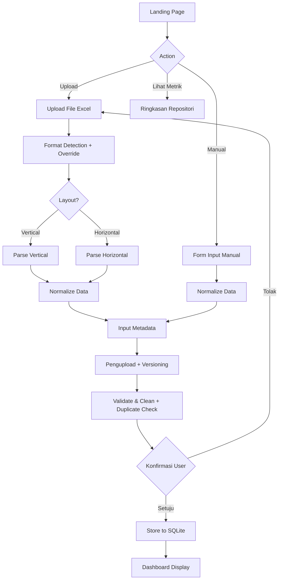

File ini berada di **`.cursor/plans/`** dalam repo (ikut Git + path yang sama dipakai Cursor). Buka proyek dari clone workspace: path relatif `.cursor/plans/bps_data_management_system_bd94389d.plan.md`. Salinan di luar repo (`%USERPROFILE%\.cursor\plans\…`) hanya perlu disamakan bila kamu mengedit plan di luar folder proyek.

# BPS Data Management System Architecture

## System Overview

A lightweight Flask system where data can enter via Upload Excel or Manual Input, landing page shows repository-level overview metrics, and dashboard renders stored data entries. **Persistence:** SQLAlchemy 2.0 dengan **`DATABASE_URL`** (SQLite file default dev, MySQL/PostgreSQL di produksi) — `docs/superpowers/plans/2026-04-15-sqlalchemy-mysql-refactor.md`.

## Data Input Workflow

### Dua Opsi Masuk Data

| Opsi             | Keterangan                      | Format Detection                         |
| ---------------- | ------------------------------- | ---------------------------------------- |
| **Upload**       | User mengunggah file Excel      | Ya — deteksi layout horizontal/vertikal  |
| **Input Manual** | User mengisi form/data langsung | Tidak — data sudah terstruktur dari form |

### Metadata Wajib (Upload & Input Manual)

Setiap upload/input harus menyertakan:

- **Pengupload**: Nama orang yang mengunggah atau menginput data.
- **Waktu unggah**: Sistem sekarang mengisi `version` dengan timestamp backend WITA saat unggah/input manual, lalu diperlakukan sebagai identitas versi untuk mencegah duplikasi dan melacak revisi.

Versioning dipakai untuk:

- Mencegah duplikasi bila ada kesalahan upload/input.
- Melacak riwayat revisi data.

## Landing Page & Navigation

- **Landing page**: entry point dengan metrik overview repository (jumlah baris data terbaru, indikator aktif, dan metadata unggahan terakhir).
- Terdapat tombol utama: Upload dan Manual Input.

## Core Components

### 0. Application layout (refactored)

- **`config.py`**: `BASE_DIR`, allowed sets, upload limits, `resolve_secret_key()`, `configure_flask_app(app, testing=...)`, `default_secret_risk_in_production`, opsional `REQUIRE_FLASK_SECRET` / peringatan jika `FLASK_ENV=production` dengan secret default (ditekan saat pytest memuat app).
- **`services/`**: `validation`, `upload_preview` (pratinjau + sesi disk `_preview_sessions` + `excel_preview_source_from_payload`), `upload_flow` (form/validasi/simpan file, konfirmasi pratinjau, respons terstruktur untuk route; `cache_upload_preview` tetap memakai Flask `session`), `request_params`, `manual_entries`, `charts`, `raw_export`, `period_analysis_workbook` (OpenPyXL multi-sheet), `period_analysis_export` (form + Flask `Response`), `period_filters`, `period_comparison_calculators` (murni), `period_comparisons` (SQL + orkestrasi), `data_management_actions`, `timeutil` (UTC ISO / timestamp), `list_view` (pagination + kwargs query + dict filter UI untuk preview/data-management).
- **`routes/`**: `register_routes(app)` mendaftarkan view lewat `add_url_rule` (endpoint sama dengan sebelum refactor). `pages.py` (landing, preview, export, plot JSON), `upload_routes.py` (upload + manual, memakai `current_app.config`), `manage.py` (data management + export period analysis).
- **`application/factory.py`**: `create_app(testing=..., init_sqlalchemy=...)` dengan `Flask(..., root_path=<repo root>)` agar `templates/` tetap ditemukan. **`app.py`**: modul tipis — `app = create_app(...)` + re-export `create_app`, `allowed_file`, `validate_metadata` untuk kompatibilitas impor tes / skrip. **`wsgi.py`**: `from app import app` untuk server produksi.
- **`models/`** (paket): `connection` (`DB_PATH`, `init_db` pada engine SQLAlchemy), `queries`, `mutations`, `browse`, `data_filters`; re-export API publik + analitik periode dari `services.period_comparisons`. Monolit `models.py` dihapus.

### 1. Data Input & Processing Pipeline

- **Upload**: Excel → Layout Detection (+ opsi override) → Parse payload (diagnostics) → Normalize → Metadata (uploader + version) → Validate → Konfirmasi sebelum simpan.
- **Manual Input**: Form → Normalize → Metadata → Validate → Store.
- **Excel Parser**: `pandas` + `openpyxl`, detect layout (horizontal vs vertical).
- **Normalization**: Samakan ke schema tunggal meskipun sumber berbeda.
- **Validation**: Cek tipe data, periode, dan metadata.

### 2. Database Schema Design

```
data_entries (
    id,
    uploader_name,
    version,
    template_type,
    data_type (flow/stock),
    time_period (monthly/quarterly/yearly),
    indicator_name,
    value,
    unit,
    region_code,
    year,
    month (NULL for non-monthly),
    quarter (NULL for non-quarterly),
    created_at
)
```

### 3. Dashboard Module

- **Visualization**: Tabel + metrik ringkas repository.
- **Filters**: Periode (bulanan/triwulanan/tahunan), data type, uploader, version.
- **Export**: CSV/Excel downloads.
- **Repository Quick Metrics**: Menampilkan jumlah baris, indikator aktif, dan rentang periode.

### 4. Data Management Focus

- **Data Focus**: Menekankan penyimpanan data dan operasi CRUD; ringkasan ringkas diturunkan langsung dari data aktif.

## Excel Template Handling (Upload-only)

### Template Format Detection

Parser sekarang memakai alur deteksi dua lapis:

- Deteksi awal otomatis untuk `layout` (vertical/horizontal) dengan `layout_override` opsional.
- Fallback ke `detect_template_format` bila materialisasi data gagal.
- `parse_excel_payload` menyertakan hasil deteksi (`layout`, `header_row`, mode parse, warnings, invalid rows) untuk dipakai pada mode pratinjau.

### Data Extraction Patterns

- **Vertical**: Periode di kolom pertama.
- **Horizontal**: Periode di header.
- **Mixed**: Strategi parsing adaptif.

## Technology Stack

- **Backend**: Flask
- **Database**: SQLite
- **Excel Processing**: pandas + openpyxl
- **Frontend**: Jinja2 + HTML sederhana (Bootstrap opsional)
- **Charts**: Chart.js (opsional)

## Data Flow Architecture



Ringkasan:

- **Upload**: Excel → Layout Detection (+override optional) → Parse payload + duplicate scan → User Confirmation (+opsi lewati duplikasi) → DB → Dashboard.
- **Manual**: Form → Normalize → Metadata → Validate → DB → Dashboard.
- **Landing Page**: Menampilkan metrik repositori + metadata terakhir, aksi menuju Upload/Manual.

## Implementation Phases

1. **Phase 1** (done): Setup Flask + landing page (repository metrics) dan capture metadata (pengupload, version).
2. **Phase 2**: Implement upload + manual input endpoints, parsing, normalization, validation.
3. **Phase 3**: Schema DB dengan metadata + normalized fields.
4. **Phase 4** (done): Bangun dashboard card metrik ringkas tanpa engine agregasi terpisah.
5. **Phase 5** (done): Dashboard UI dengan filter/periode + ringkasan repo.
6. **Phase 6** (done): Export functionality + validation/error feedback.

## Work Completed

- Flask shell with routes (`landing_page`, `upload_data`, `manual_input`, `dashboard`, `data_management`, `generate-period-analysis`) plus flash messaging.
- Template set now targets `base.html`, `landing.html`, `upload.html`, `dashboard.html`, `data_management.html` and CSS skeleton added.
- Directories `templates/`, `static/css/`, and `uploads/` created; `requirements.txt` tracks dependencies.
- Repository-level storage and query paths now drive dashboard metrics; per-data insert recalculation uses live aggregates (no separate summary cache).
- Dashboard UI now exposes filter controls and a data table that reports the persisted entries.
- Metadata validation enforces allowed `data_type`/`time_period` before persistence.
- Export route streams raw CSV/Excel from current filtered dataset.
- SQLite schema + insert helpers ready for uploader/version metadata and normalized time breakdowns.
- Excel parser + manual normalization written so both flows reuse the same persistence path.
- **Bulk operations implemented**: Added checkbox selection, bulk delete, and bulk update functionality in data management page for efficient multi-record operations.
- **Period comparison analysis implemented**: Added Q to Q, M to M, Y to Y, YTD, and C to C analysis with interactive pivot tables for indicator analysis.
- **Data management pagination implemented**: Added configurable rows per page (5, 10, 15, 20, 30, 50, 100) with persistent checkbox state across page changes.
- **UI/UX refactor completed**: Refactor visual shell, navigasi, komponen inti, dan sistem status/feedback untuk desain lebih opinionated (typografi bold, badge aksen, micro-interaksi, dan aksesibilitas terarah).
- **Preview data pagination implemented**: Added configurable rows per page (5, 10, 15, 20, 30, 50, 100) with full pagination controls.
- **Table UI consistency implemented**: Harmonized Data-Management and Preview-Data table visuals using shared table classes and metadata badge components, while keeping Data-Management actions and bulk tools unchanged.
- **Bulk operations implemented**: Added checkbox selection, bulk delete, and bulk update functionality in data management page for efficient multi-record operations.
- **Date-range filtering implemented**: Added `start_period`/`end_period` filters across Preview-Data, Data-Management, and Dashboard pages with SQL-layer filtering and URL/payload propagation to exports and analyses.
- **Value-range filtering implemented**: Added `value_min`/`value_max` filters on Preview-Data and Data-Management, including backend query propagation, pagination consistency, export filtering, and filter-based bulk delete behavior.
- **Upload preview + confirm flow implemented**: Upload now stores temporary preview state, memuat ringkasan parser (layout/source row/warnings/sample/invalid rows), menampilkan kandidat duplikasi, dan hanya menyimpan setelah user mengonfirmasi; state pratinjau disimpan di disk di bawah `UPLOAD_FOLDER` agar beberapa worker/process berbagi sesi yang sama.
- **Upload duplicate-skip option implemented**: Konfirmasi upload kini menyediakan checkbox per kandidat duplikasi, tombol kontrol cepat `Pilih Semua`, `Batal Semua`, dan `Balik Pilihan`, serta ringkasan jumlah kandidat yang dipilih untuk dikecualikan; notifikasi upload sekarang ditata agar tetap stabil di bagian atas halaman dengan lebar terbatas dan teks tidak menumpuk layout.
- **Upload duplicate preview refinement**: Baris pada `Kandidat Duplikasi` kini menampilkan nilai (Nilai) agar format sejalan dengan `Contoh data yang akan disimpan`, sambil mempertahankan checkbox per baris untuk pengecualian duplikasi.
- **Upload preview sample consistency implemented**: `parse_and_validate_upload_payload` sekarang menggunakan `PREVIEW_SAMPLE_LIMIT` sebagai default agar `sample` pada `parse_excel_payload` tidak kosong saat pratinjau upload, sehingga baris yang ditampilkan pada ringkasan pratinjau konsisten dengan total baris yang diproses.
- **Verification milestone Gate-3 complete**: `tests/simple_tests/functional_tests` dan `tests/simple_tests/bug_tests` sudah diverifikasi ulang; celah keamanan upload ditutup dengan CSRF token, session HttpOnly, dan rate limiting, kemudian diuji pada alur keamanan.

## Project Rule

- Changes to code/features must be accompanied by updates to `docs/README_DOCS.md` (changelog), `docs/planning.md` (stub checklist if needed), and **`.cursor/plans/bps_data_management_system_bd94389d.plan.md`** (YAML todos), enforced by `.cursor/rules/planning-&-executing-sync.mdc`.

## Key Challenges & Solutions

### Excel Format Variability (Upload saja)

- Parser fleksibel + deteksi layout; manual input skip format detection.

### Versioning & Dobel Upload

- Field `version` + rules (unik per batch atau per uploader+timestamp).

### Time Period & Data Type

- Normalisasi `year/month/quarter`, field `data_type` dari form/metadata.

### Repository Data Focus

- Statistik singkat dihitung dari data aktif (ringkas) setelah `Store to SQLite`, tanpa cache agregasi terpisah.

## File Structure

```
bps_data_system/
├── app.py                 # Flask app instance + compat re-exports (factory in application/)
├── application/           # create_app factory (root_path = repo root)
├── models/                # Paket SQLite (connection, queries, mutations, browse, …)
├── excel_parser.py        # Excel logic (upload-only)
├── templates/
│   ├── landing.html       # Landing page with repository metrics + metadata
│   ├── upload.html        # Form upload + manual input metadata
│   ├── dashboard.html
│   └── base.html
├── static/
│   ├── css/
│   └── js/
├── data.db
└── uploads/
```

## Documentation Update
- Added OVERVIEW.md under project root as a concise module/folder onboarding reference for contributors and agents (root scope, assets/templates/static, and key Python modules).

- **Docs Update:** OVERVIEW.md expanded with per-folder summaries for assets/static/templates dan ringkasan modul Python inti (app.py, excel_parser.py, models.py).
- [x] Buat dokumentasi detail per-folder: `assets/README.md`, `static/README.md`, `templates/README.md`, `templates/partials/README.md`.
- [x] Buat dokumentasi gabungan untuk semua berkas Python di `PY_FILES.md`.
- [x] Sinkronisasi pembaruan dokumentasi ke `docs/README_DOCS.md`, `docs/planning.md`, dan `.cursor/plans/bps_data_management_system_bd94389d.plan.md`.

## Recent Backend & Upload UX Updates

- Centralized period parsing logic into a new shared utility module `periods.py` (`parse_period_date`), now used by both `app.py` (manual input builder) and `models` (`insert_single_entry`). This removes duplicate implementations of `_parse_period_date` and keeps `period_date` handling consistent across manual and CRUD flows.
- Refined upload UX:
  - Global flash/alert component repositioned to sit below the navbar and above the page header, preventing overlapping with the Upload form or preview panel.
  - JavaScript for duplicate-candidate selection on upload preview extracted into `templates/partials/_script_upload_duplicates.html` so that `upload.html` focuses on structure while behavior lives in a dedicated partial.
- Upload refactor tracking (riwayat di git: `docs/refactor-planning.md` hingga 2026-04-17): `services/upload_flow.py` — `persist_upload_entries`, `build_upload_response`, orchestrator confirm/post-file.
- Refactor progress: `services/upload_flow.py` — helper orchestrator untuk `process_upload_confirm` (narasi panjang → `docs/README_DOCS.md` + plan SQLAlchemy).

- **Upload UX update:** 	emplates/partials/_upload_form.html kini menyediakan tombol **Unduh Template Excel** (mengarah ke static/templates/upload_template.xlsx) dan catatan format parser untuk upload yang lebih jelas.

## Update terbaru (2026-04-13)
- Iterasi lanjut menguatkan alur unggah/manual berikut preview/duplikasi dan update tampilan:
  - Rute unggah dan kontrol manual (`routes/upload_routes.py`, `templates/partials/_manual_form.html`, `templates/upload.html`).
  - Layanan unggah & pratinjau (`services/upload_flow.py`, `services/upload_preview.py`) untuk flow duplikasi lebih konsisten.
  - Penyesuaian model/helper + uji regresi (`tests/test_models.py`, `tests/test_mutations_baseline.py`, `tests/test_data_management_actions.py`, `tests/test_upload_flow.py`, `tests/test_upload_preview.py`, `tests/simple_tests/functional_tests/test_manual_entry.py`).
  - Dokumen rencana operasional ditambah di `docs/superpowers/plans/2026-04-13-logging-and-mysql-migration.md`.
