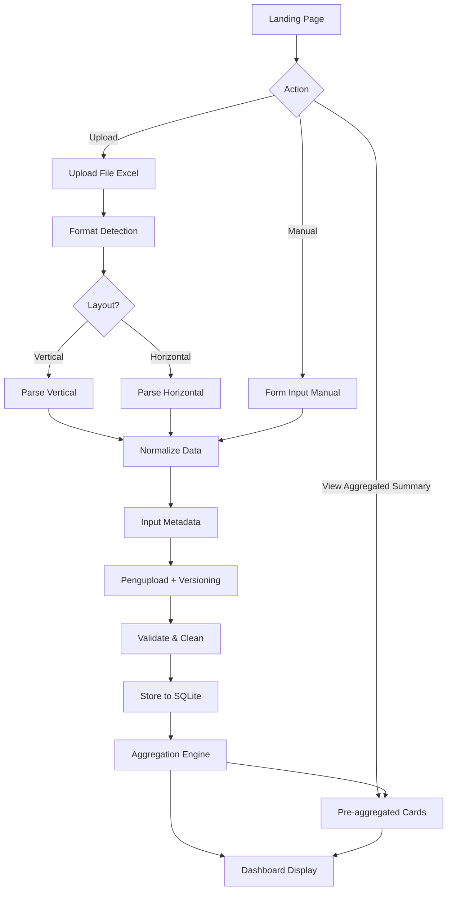

# BPS Data Management System Architecture

## System Overview

A lightweight Flask + SQLite system where data can enter via Upload Excel or Manual Input, landing page shows aggregated summaries, and dashboard renders the stored data.

## Data Input Workflow

### Dua Opsi Masuk Data

| Opsi             | Keterangan                      | Format Detection                         |
| ---------------- | ------------------------------- | ---------------------------------------- |
| **Upload**       | User mengunggah file Excel      | Ya — deteksi layout horizontal/vertikal  |
| **Input Manual** | User mengisi form/data langsung | Tidak — data sudah terstruktur dari form |

### Metadata Wajib (Upload & Input Manual)

Setiap upload/input harus menyertakan:

- **Pengupload**: Nama orang yang mengunggah atau menginput data.
- **Versioning**: Identifier versi (cont. `v1`, `2025-02-25-01`) untuk mencegah duplikasi dan melacak revisi.

Versioning dipakai untuk:

- Mencegah duplikasi bila ada kesalahan upload/input.
- Melacak riwayat revisi data.

## Landing Page & Navigation

- **Landing page**: entry point dengan summary agregat (count/sum per periode atau tipe) dan metadata terakhir.
- Terdapat tiga tombol utama: Upload, Manual Input, View Aggregated Summary.
- Aggregated summary ditarik dari layer agregasi yang sama dengan dashboard, sehingga landing page langsung menunjukkan hasil terkini tanpa query berat.

## Core Components

### 1. Data Input & Processing Pipeline

- **Upload**: Excel → Format Detection → Parse → Normalize → Metadata (uploader + version) → Validate → Store.
- **Manual Input**: Form → Normalize → Metadata → Validate → Store.
- **Excel Parser**: `pandas` + `openpyxl`, detect layout (horizontal vs vertical).
- **Normalization**: Samakan ke schema tunggal meskipun sumber berbeda.
- **Validation**: Cek tipe data, periode, dan metadata.

### 2. Database Schema Design

```
data_entries (
    id,
    uploader_name,
    version,
    template_type,
    data_type (flow/stock),
    time_period (monthly/quarterly/yearly),
    indicator_name,
    value,
    unit,
    region_code,
    year,
    month (NULL for non-monthly),
    quarter (NULL for non-quarterly),
    created_at
)
```

### 3. Dashboard Module

- **Visualization**: Tables + aggregated cards.
- **Filters**: Periode (bulanan/triwulanan/tahunan), data type, uploader, version.
- **Export**: CSV/Excel downloads.
- **Pre-aggregation Cards**: Menampilkan total flow/stock per periode, tren, dsb.

### 4. Aggregation Layer

- **Aggregation Engine**: Pre-calc sum/avg/trend per periode+tipe+region.
- **Trigger**: Jalan otomatis setelah store + manual refresh `Re-aggregate`.
- **Output**: Digunakan landing page summary + dashboard cards.
- **Freshness**: Pastikan update segera setelah data masuk agar landing page relevan.

## Excel Template Handling (Upload-only)

### Template Format Detection

```python
def detect_template_format(df):
    if df.iloc[:, 0].astype(str).str.contains(r'\d{4}').any():
        return 'vertical'
    else:
        return 'horizontal'
```

### Data Extraction Patterns

- **Vertical**: Periode di kolom pertama.
- **Horizontal**: Periode di header.
- **Mixed**: Strategi parsing adaptif.

## Technology Stack

- **Backend**: Flask
- **Database**: SQLite
- **Excel Processing**: pandas + openpyxl
- **Frontend**: Jinja2 + HTML sederhana (Bootstrap opsional)
- **Charts**: Chart.js (opsional)

## Data Flow Architecture



Ringkasan:

- **Upload**: Excel → Format Detection → Parse → Normalize → Metadata → Validate → DB → Aggregation → Dashboard.
- **Manual**: Form → Normalize → Metadata → Validate → DB → Aggregation → Dashboard.
- **Landing Page**: Menampilkan aggregated summary + metadata terakhir, aksi menuju Upload/Manual/View Summary.

## Implementation Phases

1. **Phase 1** (done): Setup Flask + landing page (pre-aggregation cards) dan capture metadata (pengupload, version).
2. **Phase 2**: Implement upload + manual input endpoints, parsing, normalization, validation.
3. **Phase 3**: Schema DB dengan metadata + normalized fields.
4. **Phase 4** (done): Build aggregation engine + landing dashboard cards (now backed by cached summaries).
5. **Phase 5** (done): Dashboard UI dengan filter/periode + aggregated summaries.
6. **Phase 6** (done): Export functionality + validation/error feedback + manual aggregation trigger.

## Work Completed

- Flask shell with routes (`landing_page`, `upload_data`, `manual_input`, `dashboard`, `aggregated_summary`, `data_management`, `generate-period-analysis`) plus flash messaging.
- Aggregator stub returning placeholder cards and metadata.
- Templates (`base.html`, `landing.html`, `upload.html`, `dashboard.html`, `aggregated.html`, `data_management.html`) and CSS skeleton added.
- Directories `templates/`, `static/css/`, and `uploads/` created; `requirements.txt` tracks dependencies.
- Aggregation cache table + refresh helpers now persist summary data; every data insert triggers a re-aggregation.
- Dashboard UI now exposes filter controls and a data table that reports the persisted entries.
- Metadata validation enforces allowed `data_type`/`time_period` before persistence.
- Export route streams raw CSV/Excel prior to aggregation so analysts can download first-pass data.
- SQLite schema + insert helpers ready for uploader/version metadata and normalized time breakdowns.
- Excel parser + manual normalization written so both flows reuse the same persistence path.
- **Bulk operations implemented**: Added checkbox selection, bulk delete, and bulk update functionality in data management page for efficient multi-record operations.
- **Period comparison analysis implemented**: Added Q to Q, M to M, Y to Y, YTD, and C to C analysis with interactive pivot tables for indicator analysis.
- **Data management pagination implemented**: Added configurable rows per page (5, 10, 15, 20, 30, 50, 100) with persistent checkbox state across page changes.
- **Preview data pagination implemented**: Added configurable rows per page (5, 10, 15, 20, 30, 50, 100) with full pagination controls.

## Project Rule

- Changes to code/features must be accompanied by updates to both `planning.md` and `c:\Users\PENGOLAHAN\.cursor\plans\bps_data_management_system_bd94389d.plan.md`, as enforced by `.cursor/rules/planning-sync.mdc`.

## Key Challenges & Solutions

### Excel Format Variability (Upload saja)

- Parser fleksibel + deteksi layout; manual input skip format detection.

### Versioning & Dobel Upload

- Field `version` + rules (unik per batch atau per uploader+timestamp).

### Time Period & Data Type

- Normalisasi `year/month/quarter`, field `data_type` dari form/metadata.

### Aggregation Freshness & Landing Page Performance

- Pre-computed summaries di-refresh sesudah `Store to SQLite` dan manual trigger.
- Landing page/dashboard membaca agregasi yang sama agar UI responsif tanpa query berat.

## File Structure

```
bps_data_system/
├── app.py                 # Flask app + landing/upload/manual/dashboard routes
├── models.py              # DB models (uploader_name, version)
├── excel_parser.py        # Excel logic (upload-only)
├── aggregator.py          # Pre-aggregation logic for landing & dashboard
├── templates/
│   ├── landing.html       # Landing page with aggregated cards + metadata
│   ├── upload.html        # Form upload + manual input metadata
│   ├── dashboard.html
│   └── base.html
├── static/
│   ├── css/
│   └── js/
├── data.db
└── uploads/
```
